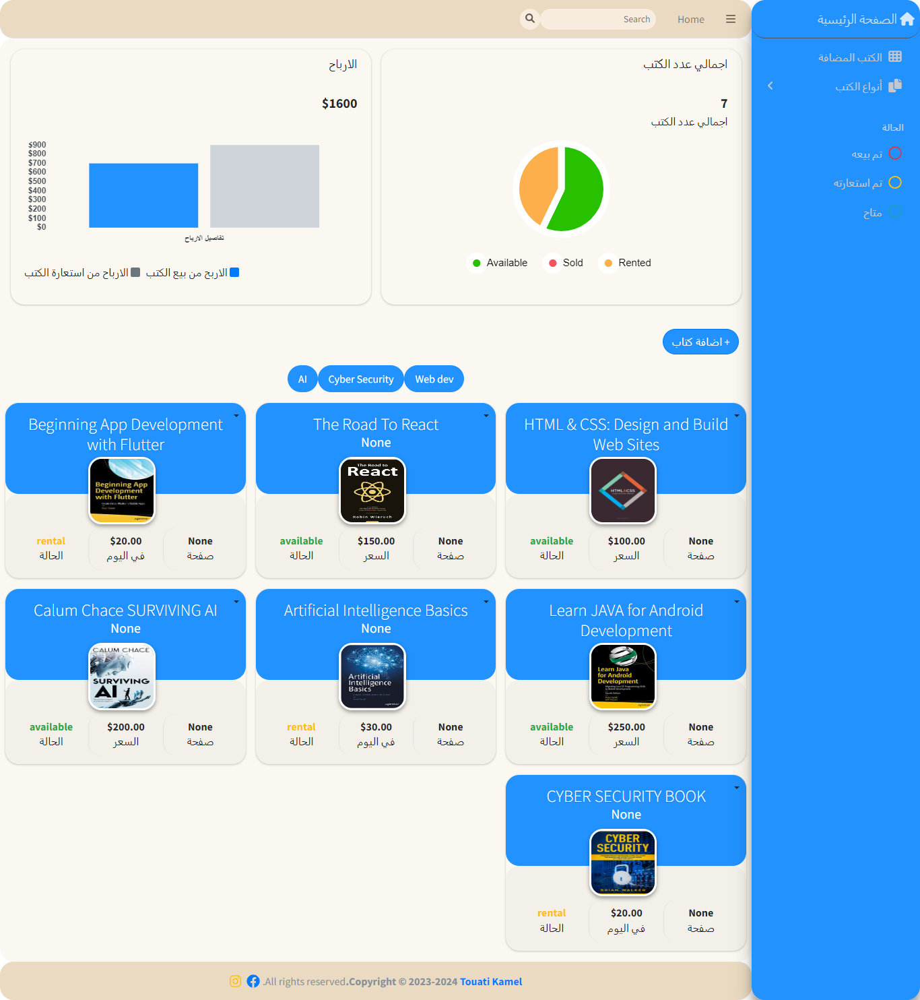
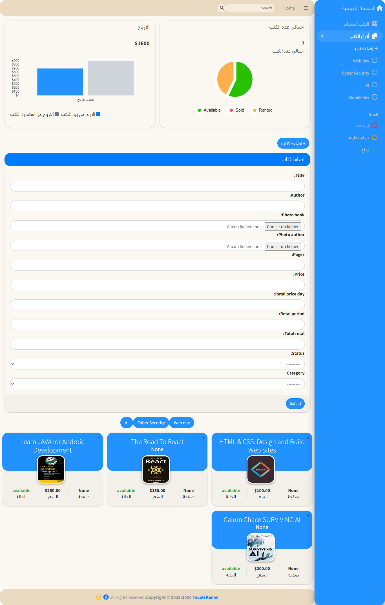
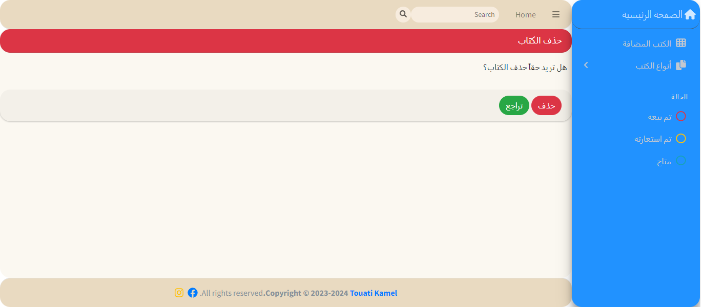

# Library-management-system-project

# Description
The Library Management System is a website application designed to manage the operations and activities of a library. This system provides a convenient way to organize and track books.
## Features
Book Management: Add, update, and delete books from the library. Keep track of book details such as title, author, publication date, and availability status.

Reservation System: Allow members to reserve books that are currently unavailable. Automatically notify members when the reserved books become available.

Search and Filtering: Provide a search functionality to find books by title. Implement filtering options to narrow down the search results based on various criteria.

## Screenshots







### Installation

1. Clone the repository: `git clone https://github.com/KamelTouati/Library-management-system-project`
2. Navigate to the project directory: `cd LibManagSysEnv`
3. Create and activate a virtual environment (optional but recommended):
   - For Windows (using Command Prompt):
     ```
     python -m venv venv
     venv\Scripts\activate
     ```
   - For macOS/Linux:
     ```
     python3 -m venv venv
     source venv/bin/activate
     ```
4. Install the required packages: `pip install django`
5. Perform database migrations:
    ```
    python manage.py migrate
    ```
6. Create a superuser:
    ```
    python manage.py createsuperuser
    ```
7. Start the development server:
    ```
    python manage.py runserver
    ```
8. Open your web browser and visit `http://localhost:8000` to access the application.


## Technologies Used


## Contributions

Contributions are welcome! If you have any ideas or suggestions, feel free to open an issue or submit a pull request.

## Contact Information

For any questions or feedback, please contact [kamel touati](mailto:kameltouati19.work@gmail.com).